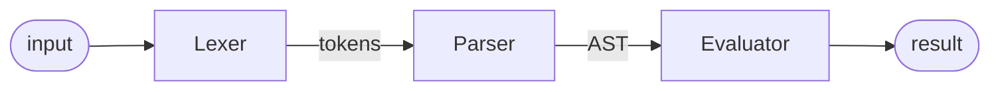

# SimpleInterpreter

A simple programming language interpreter written in Java.

## Implemented parser type

The interpreter is built on top of a [recursive descent parser](https://www.wikiwand.com/en/articles/Recursive_descent_parser)
that uses [Pratt Parsing technique](https://en.wikipedia.org/wiki/Operator-precedence_parser#Pratt_parsing) for expression
precedence handling.

## Implemented features

- Implemented **types**: `integer`, `boolean`, `array`, `string`.

- **Let statement**: used to declare a variable in the environment. In the following example, `a` is an identifier:
    ```
    > let a = 2
    null

    > a
    2
    ```

- **Boolean infix operators**: `<`, `>`, `<=`, `>=`, `==`, `!=`:
    ```
    > 1 == 2
    false

    > 2 <= 5
    true
    ```

- **Integer infix operators**: `+`, `-`, `*`, `/`:
    ```
    > 1 + 2
    3

    > 2 * 5
    10
    ```

- **Boolean prefix operators**: `!`:
    ```
    > !true
    false
    ```

- **Integer prefix operators**: `-`:
    ```
    > -1
    -1
    ```

- All common operations between integers (addition, subtraction, multiplication, division):
    ```
    > 1+2+3
    6

    > 3-2
    1

    > 3*2
    6
    ```

- Common operators precedence of an expression:
    ```
    > 2+3*2
    8

    > 5+6/2
    8
  
    > 1 + 2 >= 3 + 5
    false
    ```

- Parentheses to change the default operator precedence of an expression:
    ```
    > (2+3)*2
    10

    > (2+6)/2
    4
    ```

- **Conditional expression**: if the boolean condition is `true` then the `if-branch` is evaluated. It is evaluated the
`else-branch` otherwise:
    ```
    > if(1 < 5) { 2 } else { 3 }
    2
  
    > if(10 < 5) { 2 } else { 3 }
    3
  
    > if(10 < 5) { 2 }
    null
    ```

- **Function expression**: create a callable function that returns the result of the last executed statement if called:
    ```
    > fn(){ 1 + 2 }
    null
  
    > let add = fn(x, y){ x + y }
    null
  
    > add(5,4)
    9
    ```

- **Call expression**: call a callable function and return its result:
    ```
    > fn(x){ x + 2 }(8)
    10
  
    > let add = fn(x, y){ x + y }
    null
  
    > add(2, 3)
    5
  
    > let adder = fn(x) { fn(n) { n + x } }
    null
    
    > adder(1)(15)
    16
    ```

- **Return statement**: immediately return an expression from a block statement:
    ```
    > let test = fn() {
    ..   if(true) {
    ..     1+2
    ..     return 1
    ..     2*2
    ..   } else {
    ..     return 2
    ..     3*3
    ..   }
    ..   return 3
    ..   4*4
    .. }
    null
  
    > test()
    1
    ```

- **Closures**: the combination of a function bundled together (enclosed) with references to its surrounding state
(lexical environment). A Closure gives a function access to its outer scope:
    ```
    > let adder = fn(x) { fn(n) { n + x } }
    null
    
    > let adderTwo = adder(2)
    null
  
    > adderTwo(10)
    12
    ```
  *Explained example*: `adder` has the parameter `x` (its local variable). The anonymous inner function has the parameter `n` (its local variable). 
The inner function returns the sum of `n` and `x`. The inner function has access to the variable `x` that is declared in the outer scope.

- **Array indexing and reverse indexing**:
    ```
    > let a = [1,2,3]
    null
    
    > a[1]
    2
  
    > a[-1]
    3
  
    > let b = [fn(x) { x + 1 }, 3 + 5, !true]
    null
  
    > a[0](2)
    3
    ```

- **String indexing and reverse indexing**:
    ```
    > let a = "hello world"
    null
    
    > a[0]
    "h"
  
    > a[-1]
    "d"
    ```

- **Builtin functions**: `print`, `len`, `first`, `rest`, `push`, `append`, `pop`, `removeLast`. If a builtin function is
typed in the interpreted, the builtin help function will be displayed:
    ```
    > print
        print(x -> any, ...) -> null: prints all parameters
    ```
  The following builtin functions are included in the language:
    - `print`: `print(x -> any, ...) -> null`: prints all parameters.
    - `len`: `len(x -> array|string) -> integer`: returns the number of elements in `x`.
    - `first`: `first(x -> array|string) -> any|string`: returns the first element in `x`.
    - `rest`: `rest(x -> array|string) -> array|string`: returns all the elements in `x` excluded the first element.
    - `push`: `push(x -> array|string, y: any) -> array|string`: returns a new object with the new element `y` added as first element of `x`.
    - `append`: `append(x -> array|string, y: any) -> array|string`: returns a new object with the new element `y` added as last element of `x`.
    - `pop`: `pop(x -> array|string) -> any|string`: removes the first element from `x` and returns it.
    - `removeLast`: `removeLast(x -> array|string) -> any|string`: removes the last element from `x` and returns it.

- **Postfix operators**: increment (`++`), decrement (`--`). Both operators perform the increment/decrement by `1` and return the previous value:
    ```
    > let a = 1
    null
    
    > a++
    1
  
    > a
    2
  
    > a--
    2
  
    > a
    1
    ```

- **While statement**: the block statement is evaluated while the boolean condition is `true`:
    ```
    > let a = 0
    null

    > while(a < 2) {
    ..   print(append("a = ", a))
    ..   a++
    .. }

    "a = 0"
    "a = 1"
    null

    > a
    2
    ```

- **Recursion**: the recursive function can call itself from within its own code:
    ```
    > let fact = fn(n) {
    ..   if(n == 0) {
    ..     return 1
    ..   } else {
    ..     return n * fact(n - 1)
    ..   }
    .. }
  
    > fact(5)
    120
    ```

- Read and execute the program source code from a file:
    ```bash
    user@host:~$ java -jar SimpleInterpreter-1.0.0.jar -f program
    ```

## Help message

```
Usage: <jar file name> [-hV] [-f=<filePath>] [-ml | -mp | -me]
A simple language interpreter written in Java.
  -f, --file=<filePath>   Read program from file path.
  -h, --help              Show this help message and exit.
      -me, --mode-evaluator
                          Enable evaluator mode [default].
      -ml, --mode-lexer   Enable lexer mode.
      -mp, --mode-parse   Enable parse mode.
  -V, --version           Print version information and exit.
```

## Execution modes

- **Lexer mode**: enable only the Lexer module. It converts a sequence of characters into a sequence of lexical tokens
(Lexical Analysis). A lexical token or token is a string with an assigned and thus identified meaning.

- **Parser mode**: enable only the Lexer and the Parser modules. Uses the stream of tokens to check the syntactic
structure of the input and generate the Abstract Syntax Tree (Syntax Analysis). The implemented parser is a
Recursive Descent Parser that uses the Pratt Parsing technique to handle operator precedence.

- **Evaluator mode**: enable Lexer, Parser and Evaluator modules. Interprets the AST (Abstract Syntax
Tree) on the fly (without compiling it) and produces the result of the input expression.

## Modules and interactions



## Build JAR using Maven

```bash
user@host:~$ mvn package
```

## Run JAR file

```bash
user@host:~$ java -jar SimpleInterpreter-1.0.0.jar
```

To exit the program type an empty line or use the **Ctrl+C**.

## References

The really useful book [Writing an Interpreter in Go](https://interpreterbook.com/) written by Thorsten Ball.

Some other articles that I used:

- [Pratt Parsers: Expression Parsing Made Easy](https://journal.stuffwithstuff.com/2011/03/19/pratt-parsers-expression-parsing-made-easy/)
